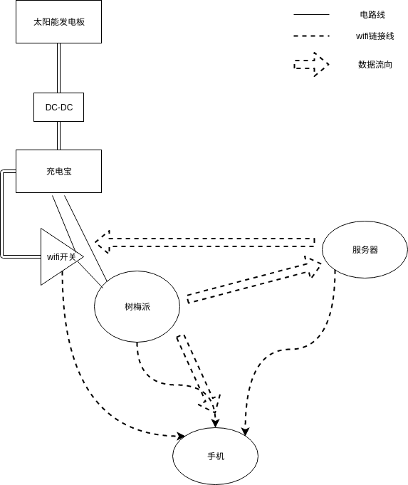
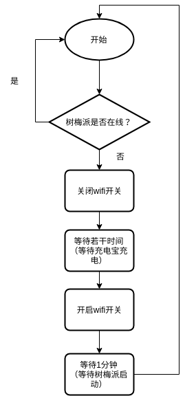
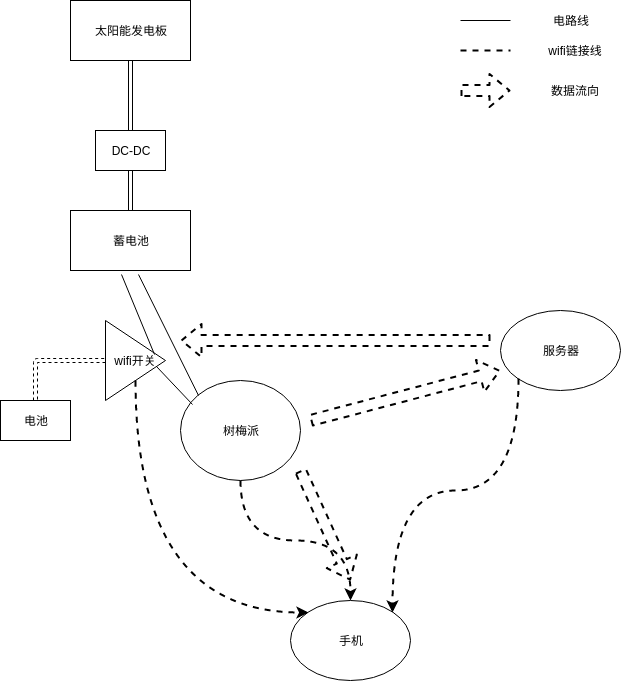

# <嵌入式系统>实验报告

计54 陈宇 2015011343

## 实验目的

测量树梅派和太阳能发电板等元器件的能耗与功率，探索用太阳能发电板给树梅派供电的解决方案。

## 数据测量

##### 1. 树梅派在标准负载下的功率消耗

以下为几个不同场景的测量数据，测量方式均为每隔1分钟记录一次数据，共记录10次。

场景一：采用标准电源供电，带HDMI和键盘鼠标：

| # | V | A |
| - | - | - |
| 1 | 4.99 | 0.64 |
| 2 | 4.99 | 0.67 |
| 3 | 4.99 | 0.67 |
| 4 | 4.99 | 0.64 |
| 5 | 4.99 | 0.64 |
| 6 | 4.99 | 0.67 |
| 7 | 4.99 | 0.67 |
| 8 | 4.99 | 0.67 |
| 9 | 4.99 | 0.64 |
| 10 | 4.99 | 0.67 |

注：标准电源指的是用USB电源适配器进行供电

场景二：标准电源供电，不带HDMI和键盘鼠标：

| # | V | A |
| - | - | - |
| 1 | 4.98 | 0.55 |
| 2 | 4.98 | 0.52 |
| 3 | 4.98 | 0.55 |
| 4 | 4.98 | 0.55 |
| 5 | 4.98 | 0.55 |
| 6 | 4.98 | 0.55 |
| 7 | 4.98 | 0.52 |
| 8 | 4.98 | 0.55 |
| 9 | 4.98 | 0.55 |
| 10 | 4.98 | 0.55 |

场景三：充电包供电，不带HDMI和键盘鼠标：

| # | V | A |
| - | - | - |
| 1 | 5.07 | 0.52 |
| 2 | 5.07 | 0.55 |
| 3 | 5.07 | 0.55 |
| 4 | 5.07 | 0.55 |
| 5 | 5.07 | 0.55 |
| 6 | 5.07 | 0.55 |
| 7 | 5.07 | 0.55 |
| 8 | 5.07 | 0.55 |
| 9 | 5.07 | 0.52 |
| 10 | 5.07 | 0.55 |

实验发现，HDMI不怎么耗电，而鼠标和键盘的耗电情况根据鼠标键盘自身的不同而不同。

##### 2. 充电宝容量

20000 × 3.7V * 1mAh = 74Wh

##### 3. 太阳能电池功率(太阳较充足，测量经过DC-DC模块转换之后给充电包供电时的数据)

| # | V | A |
| - | - | - |
| 1 | 4.86 | 0.87 |
| 2 | 4.87 | 0.93 |
| 3 | 4.93 | 1.08 |
| 4 | 4.94 | 0.87 |
| 5 | 4.96 | 1.02 |
| 6 | 4.96 | 0.87 |
| 7 | 4.96 | 0.87 |
| 8 | 4.96 | 1.08 |
| 9 | 4.96 | 0.90 |
| 10 | 4.96 | 0.90 |

## 实验内容

在我的实验方案中，一共可以分为3个部分：

1. 树梅派：电源受wifi开关控制，其上面运行着心跳程序和监控程序，心跳程序每秒中将当前的状态报告给服务器，监控程序实时将当前的录像发送给手机
2. 手机：提供无线热点供树梅派/wifi开关/服务器链接，其上面运行着监控程序的接收程序
3. 服务器：能够控制wifi开关，接收树梅派心跳程序发来的数据

原理图如下：

其中，服务器上运行着一个管理程序，主要具有两个功能：

1. 监控wifi开关和树梅派的状态
2. 在检测到充电宝电量不足时，关闭树梅派的供电，等到有足够电量之后再打开

管理程序运行截图如下：

监控界面：

控制界面：

其中，“延迟启动设置”是主动功能，效果是当前关闭树梅派，并在设置的之间之后再启动。

而“低电量重启设置”是被动功能，其工作模式如下：

## 实验中遇到的问题

从上面的数据测量中可以看出，在太阳光足够的情况下，太阳能发电板是可以供给树梅派的消耗的，但是实际情况中，晴天天气下足够的太阳光也只能维持不超过4个小时，在其他时间段的功率会大打折扣。

但是太阳能发电板并不是主要问题，这个实验中最严重的问题其实是充电宝，主要有以下问题：

1. 在使用太阳能发电板对充电宝进行充电的情况下，由于充电宝输入电压和电流有小幅度的波动，导致充电宝内部的保护机制会切断能量输出
2. 充电宝在耗尽电量之后会切断能量输出，然后使用额外电源给充电包供电，但是在有足够电量之后，充电宝并不会自动重新供电，需要按下充电宝上面的按钮才会供电，导致我的设计中“低电量重启设置”功能并不能使用

可以看出，充电宝其设计之初是给人使用的，所以其一些特性对于本实验造成了阻碍，将充电包换成普通蓄电池的话也许会好很多。

## 理想实验方案

通过对本实验不足的地方进行分析，得出了我心目中较为理想的实验方案，如下：

主要电话是1. 将充电宝换成了蓄电池 和 2. 使用单独的电池对wifi开关进行供电

由于wifi开关的功耗低，实测只有0.1W不到，可以使用2节18650电池供电。每节18650电池的电压为3.7V，容量为1700~3350mAh，1700mAh的电池可以运行的时间为：

$$
2 * 1700 / 1000 * 3.7 / 0.1 = 125.8h = 5.2天
$$

如果换用更高容量的电池供电时间会更长，对wifi开关单独供电是可行的。
